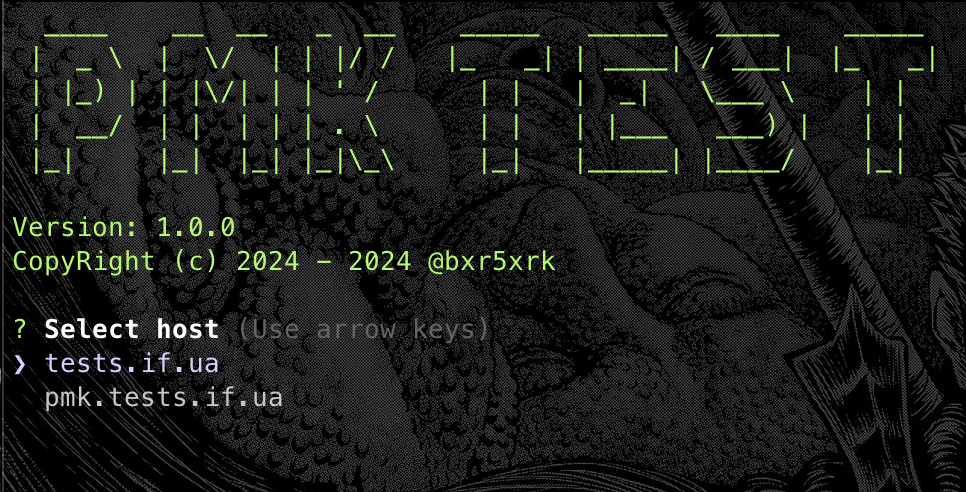

# pmk cli client



template:

```javascript
fetch('http://localhost:8080', {
  method: 'POST',
  headers: {
      'Content-Type': 'text/plain',
  },
  body: ``,
});

fetch(`http://127.0.0.1:8080?userAgent=${encodeURIComponent(window.navigator.userAgent)}`)
```

https://chatgpt.com/c/670415ea-e3f4-800f-ade7-234bdeaa1f36